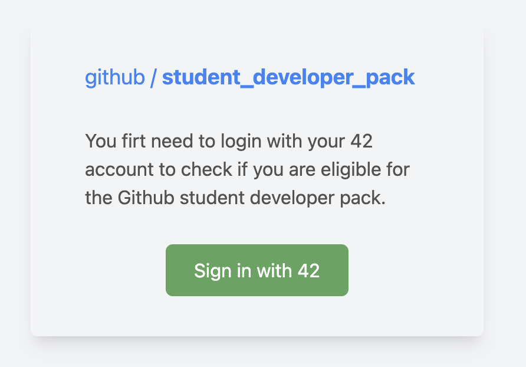
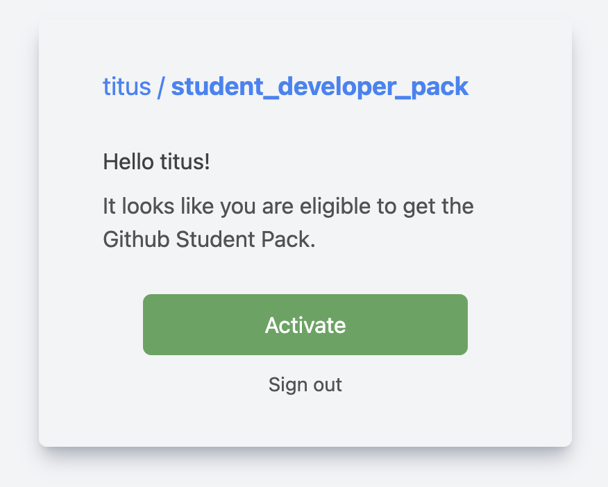

<h1 align="center"><code>ft_github</code></h1>

<div align="center">
  <sub>Created by <a href="https://github.com/jgengo">Jordane Gengo (Titus)</a></sub>
</div>
<div align="center">
  <sub>From <a href="https://hive.fi">Hive Helsinki</a></sub>
</div>

<h1 align="center">Proof-of-Concept</h1>

`ft_github` is a proof-of-concept project designed to offer an alternative to [Hive Helsinki](https://www.hive.fi)’s existing application. This tool allows Github education managers within the 42network to generate activation links for students to access Github's student benefits. With this solution, we reduced the container size from 1.3GB to just 136MB.

<br>



<br><br>



<br>

Please note that if you are not a school maintainer recognized by Github, you may not have the necessary secrets to run the application. However, you can still use this project as an example to log in via 42 OAuth.

<br>

## Features

- OAuth integration with 42 intra for authentication.
- Simple UI built with Next.js and Tailwind CSS.
- Lightweight and optimized for performance.

## Getting Started

### Prerequisites

- [Create an intra API app](https://profile.intra.42.fr/oauth/applications/new).
- Clone the repository and create a `.env` file:

```bash
cp .env.sample .env
```

- Fill in the required environment variables in the .env file.

### Running the project

To start the development server:

```bash
npm run dev
# or
yarn dev
# or
pnpm dev
```

Visit http://localhost:3000 in your browser to view the application.

<br>

## License
This project is licensed under the MIT License - see the LICENSE file for details.

## Contact
For any inquiries, please contact me.
